# HumanEval SCoT Code Generation(main.py)

A lightweight implementation using **Structured Chain-of-Thought (SCoT)** prompting with **LangChain** to generate accurate Python code solutions for HumanEval benchmark problems.

## 🎯 What Does This Do?

This system generates Python code by first creating structured reasoning (SCoT), then using that reasoning to write correct code. If the code fails tests, it automatically attempts to fix errors.

**Process Flow:**
```
Problem → SCoT Reasoning → Code Generation → Test → Fix (if needed) → Result
```

---

## 🏗️ Architecture

```mermaid
graph TD
    A[HumanEval Problem] --> B[Generate SCoT]
    B --> C[Generate Code from SCoT]
    C --> D[Post-Process Code]
    D --> E{Run Tests}
    E -->|Pass| F[Success ✓]
    E -->|Fail| G[Fix Code with Error]
    G --> H{Re-test}
    H -->|Pass| F
    H -->|Fail| I[Failed ✗]
```



---

## 📦 Installation

```bash
# Install dependencies
pip install langchain-openai human-eval

# Set your API key
export OPENAI_API_KEY="your-key-here"
```

---

## 🚀 Quick Start

```python
from humaneval_scot import main

# Edit API key in main()
API_KEY = "your-openai-api-key"

# Run evaluation
main()
```

**Output:**
```
Processing: HumanEval/0
✓ SCoT generated
✓ Code generated
✓ Code passed all tests!

EVALUATION RESULTS
══════════════════════════════════════
Total Problems: 2
Successful: 2
Failed: 0
Pass@1 Rate: 100.00%
```

---

## 🧩 Key Components

### 1. **Configuration**
```python
@dataclass
class Config:
    model_name: str = "gpt-4o"
    scot_temperature: float = 0.8    # Creative reasoning
    code_temperature: float = 0.0    # Deterministic code
    max_tokens: int = 2048
```

### 2. **SCoT Generation**
```python
def generate_scot(llm, problem_description):
    """
    Generates structured reasoning using 4 program structures:
    - Sequence: Sequential steps
    - Branch: Conditional logic
    - Loop: Iterations
    - Input-Output: Parameters and returns
    """
```

### 3. **Code Generation**
```python
def generate_code_from_scot(llm, problem, scot, func_sig, docstring):
    """
    Uses SCoT reasoning to generate Python implementation
    """
```

### 4. **Error Correction**
```python
def fix_code_with_error(llm, code, error, problem):
    """
    Analyzes error and generates fixed version
    """
```

### 5. **Testing**
```python
def run_code_with_tests(code, test_code, entry_point):
    """
    Executes code in isolated subprocess with timeout
    """
```

---

## 📊 How It Works

### **Stage 1: Problem Input**
```python
problem = {
    "task_id": "HumanEval/0",
    "prompt": "def has_close_elements(numbers, threshold)...",
    "entry_point": "has_close_elements",
    "test": "def check(candidate): assert..."
}
```

### **Stage 2: SCoT Generation** (Temperature: 0.8)
```
Structured Chain-of-Thought:

1. Sequence Structure:
   - Iterate through all number pairs
   - Calculate absolute difference
   - Compare with threshold

2. Branch Structure:
   - IF distance < threshold → return True
   - ELSE → continue checking

3. Loop Structure:
   - Nested loop: outer (i), inner (j)
   - Skip when i == j

4. Input-Output:
   - Input: List[float], float
   - Output: bool
```

### **Stage 3: Code Generation** (Temperature: 0.0)
```python
def has_close_elements(numbers: List[float], threshold: float) -> bool:
    for idx, elem in enumerate(numbers):
        for idx2, elem2 in enumerate(numbers):
            if idx != idx2:
                distance = abs(elem - elem2)
                if distance < threshold:
                    return True
    return False
```

### **Stage 4: Testing**
- Runs in subprocess (sandboxed)
- 10-second timeout
- Executes all test cases
- Returns Pass/Fail + error message

### **Stage 5: Error Correction** (if needed)
- Analyzes error message
- Generates fix with error context
- Re-tests fixed code

---

## 🔧 Helper Functions

### **extract_code()**
Extracts Python code from markdown blocks:
```python
# Input: "```python\ndef foo():\n    pass\n```"
# Output: "def foo():\n    pass"
```

### **parse_problem()**
Extracts function signature and docstring from prompt:
```python
# Returns: (func_signature, docstring)
```

### **post_process_code()**
Cleans generated code:
- Removes conflicting imports
- Fixes function names
- Ensures entry point matches

---

## 📈 Evaluation Metrics

### **Pass@1 Rate**
```
Pass@1 = Successful Problems / Total Problems

Example:
- Total: 164 problems
- Success: 140 problems
- Pass@1: 85.37%
```

### **Output Format**
```json
{
  "total_problems": 164,
  "successful_problems": 140,
  "failed_problems": 24,
  "pass_at_1": 0.8537,
  "pass_at_1_percentage": "85.37%"
}
```

---

## 🎤 Interview Q&A

### **Q: What is Structured Chain-of-Thought (SCoT)?**
**A:** Instead of directly generating code, we first generate structured reasoning broken down by programming structures (sequence, branch, loop, I/O). This mirrors how programmers think and improves accuracy by ~14%.

### **Q: Why use LangChain?**
**A:** LangChain provides clean abstractions for LLM interactions:
- `PromptTemplate` for type-safe prompts
- `SystemMessage` and `HumanMessage` for role separation
- Easy integration with other tools

### **Q: Why different temperatures?**
**A:**
- **SCoT (0.8)**: Higher temperature encourages creative, diverse reasoning approaches
- **Code (0.0)**: Lower temperature ensures deterministic, consistent implementations

### **Q: How does error correction work?**
**A:** If code fails:
1. Capture error message
2. Send original code + error to model
3. Model generates fix focusing on the specific error
4. Re-test fixed code
5. One retry attempt per problem

### **Q: How is this different from direct code generation?**
**A:** 
- **Direct**: Problem → Code (less accurate)
- **SCoT**: Problem → Reasoning → Code (more accurate, explainable)

---

## 🔄 Complete Flow Example

```python
# Input
problem = "Check if any two numbers are closer than threshold"

# Step 1: SCoT
scot = """
1. Sequence: Compare all pairs, check distance
2. Branch: If distance < threshold, return True
3. Loop: Nested iteration through list
4. Output: Boolean result
"""

# Step 2: Code
code = """
def has_close_elements(numbers, threshold):
    for i, a in enumerate(numbers):
        for j, b in enumerate(numbers):
            if i != j and abs(a - b) < threshold:
                return True
    return False
"""

# Step 3: Test
run_tests(code)  # → Pass ✓

# Step 4: Result
return True  # Success!
```

---

## 🛠️ Configuration Options

| Parameter | Value | Purpose |
|-----------|-------|---------|
| `model_name` | "gpt-4o" | LLM model |
| `scot_temperature` | 0.8 | Creative reasoning |
| `code_temperature` | 0.0 | Deterministic code |
| `max_tokens` | 2048 | Response length |
| `timeout` | 10s | Execution limit |

---

## 📁 Project Structure

```
humaneval_scot.py
├── Configuration (Config dataclass)
├── Prompt Templates
│   ├── SCOT_GENERATION_PROMPT
│   ├── CODE_GENERATION_PROMPT
│   └── ERROR_CORRECTION_PROMPT
├── Helper Functions
│   ├── extract_code()
│   ├── parse_problem()
│   ├── post_process_code()
│   └── run_code_with_tests()
├── Core Functions
│   ├── generate_scot()
│   ├── generate_code_from_scot()
│   └── fix_code_with_error()
├── Main Pipeline
│   ├── process_single_problem()
│   ├── evaluate_results()
│   └── main()
```

---

## ⚡ Performance

- **Accuracy**: ~85% Pass@1 (target: 90%+)
- **Speed**: 5-10 seconds per problem
- **Cost**: ~$0.01-0.02 per problem
- **Retry Success**: ~60% of failed problems pass after fix

---

## 🚨 Common Issues

### Issue 1: Import Errors
```python
# Problem: "ModuleNotFoundError: No module named 'typing'"
# Solution: post_process_code() removes conflicting imports
```

### Issue 2: Function Name Mismatch
```python
# Problem: Generated function name != entry_point
# Solution: post_process_code() fixes function names
```

### Issue 3: Timeout
```python
# Problem: Infinite loops
# Solution: 10-second timeout kills process
```

---

## 🎯 Key Advantages

✅ **Simple & Clean**: Procedural design, easy to understand  
✅ **LangChain Integration**: Works with existing LangChain projects  
✅ **Automatic Error Fixing**: Retry mechanism improves success rate  
✅ **Real Dataset**: Uses official HumanEval problems  
✅ **Fast Prototyping**: Minimal code, quick experiments  

---

## 🔗 Comparison with Research Version

| Feature | Git (LangChain) | Research (OpenAI) |
|---------|-----------------|-------------------|
| Framework | LangChain | Direct OpenAI API |
| Architecture | Procedural | Object-Oriented |
| Solutions | 1 per problem | 5 per problem |
| Metrics | Pass@1 only | Pass@1 & Pass@5 |
| Complexity | ~300 lines | ~800 lines |
| Use Case | Prototyping | Research/Production |

**Use this version for**: Learning, demos, integration with LangChain  
**Use research version for**: Benchmarks, papers, production

---

## 📚 References

- **SCoT Paper**: "Structured Chain-of-Thought for Code Generation"
- **HumanEval**: https://github.com/openai/human-eval
- **LangChain**: https://python.langchain.com/

---

## 🤝 Contributing

Improve prompts, add features, or optimize performance:
1. Fork the repository
2. Make changes
3. Test on HumanEval problems
4. Submit pull request

---

## 📄 License

MIT License - Free for academic and commercial use

---

**Simple. Effective. Research-backed. 🚀**
